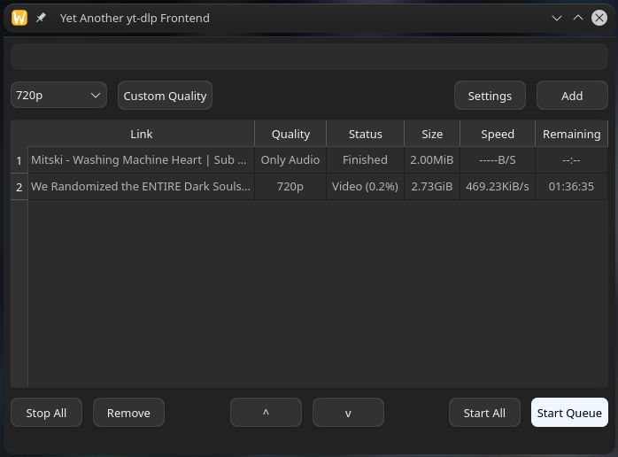

# Yet-Another-yt-dlp-Frontend

Simple yt-dlp frontend made with Pyside6.

Tested on Debian Trixie and CachyOS, both KDE, and Windows 10.

If you double-click the item on the table it will make a small window with the stdout of that process, everything else should be 'intuitive', graphic design is my passion. Check the settings for the download location.

DEPENDENCIES

-It can get the latest yt-dlp directly from the settings but still you have to manually install the yt-dlp dependencies for it to work. 
-This download is made via curl so it also need that. 
Besides that the build is made with pyinstaller so it shouldn't have any other dependency.
 

Windows version comes with the ffmpeg and ffprobe binaries so it shouldnt have any problems running.

Link to the amazing yt-dlp page: https://github.com/yt-dlp/yt-dlp
